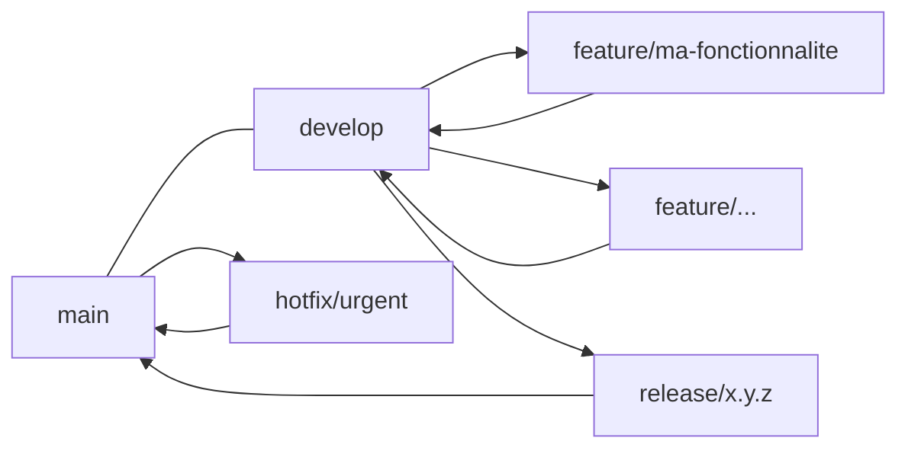

# Projet CI/CD DevOps – API Mobile

## Présentation du projet

Ce dépôt propose la mise en œuvre complète d’un pipeline CI/CD pour le déploiement automatisé d’une API destinée à une application mobile, avec une infrastructure scalable, résiliente et maintenable.

- **API** : Exemple Node.js (modifiable)
- **Infrastructure** : Terraform (IaaS sur cloud)
- **Configuration** : Ansible (provisioning)
- **CI/CD** : GitHub Actions
- **Monitoring** : logs + outils (ex : Grafana/Prometheus)
- **Snapshots** : sauvegardes automatisées
- **Rollback** : procédures de restauration
- **Versionnement** : SemVer + Git tags
- **Gestion Git** : GitFlow

## Structure du dépôt

```
appli/           # Code source de l’API
terraform/       # Scripts Terraform (infra as code)
ansible/         # Rôles et playbooks Ansible (config serveurs)
.github/workflows/ # Pipelines CI/CD (YAML GitHub Actions)
monitoring/      # Outils/logs de supervision
rollback/        # Scripts ou procédures de restauration
snapshots/       # Configs ou scripts de sauvegarde
.git/            # Historique Git (branches, tags, etc.)
tags/            # Fichiers de versionnement sémantique (ex: v1.0.0)
README.md        # Documentation complète
```

## GitFlow

Le projet utilise la stratégie GitFlow pour garantir une gestion claire et collaborative du code :

- **Branches principales** :
  - `main` : production
  - `develop` : intégration continue
- **Branches secondaires** :
  - `feature/<nom>` : développement de fonctionnalités
  - `release/<version>` : préparation de release
  - `hotfix/<nom>` : corrections urgentes


### Schéma GitFlow (exemple)


main ──────┬───────────────┐
           │               │
       [merge]         [merge]
           │               │
develop ─────┬─────────────┼─────┬─────────────┐
             │             │     │             │
     feature/xxx   release/x.y.z │    hotfix/xxx
             │             │     │             │
         [merge]      [merge] [merge]      [merge]
             │             │     │             │
         develop         main  main         main
```

- Chaque fonctionnalité part de `develop` et y revient.
- Les releases et hotfix fusionnent dans `main` (et `develop` si besoin).
- Voir captures d'écran dans `/gitflow/` ou ci-dessous.

## CI/CD

- Voir `.github/workflows/`
- Étapes : Lint, Test, Build, Packaging, Deploy (staging/prod), Snapshot, Rollback

## Versionnement

- SemVer (`v1.0.0`)
- Artefacts : voir `/tags/` et GitHub Releases

## Secrets & Environnements

- Voir `/ansible/` et `.github/workflows/`
- Séparation staging/production, bonnes pratiques

## Monitoring, Snapshots, Rollback

- Voir `/monitoring/`, `/snapshots/`, `/rollback/`

## Complétez chaque dossier avec vos fichiers spécifiques et adaptez selon vos besoins.

---

> **Auteur** : [Aurélien Ferrari]
> **Date** : Juin 2025
